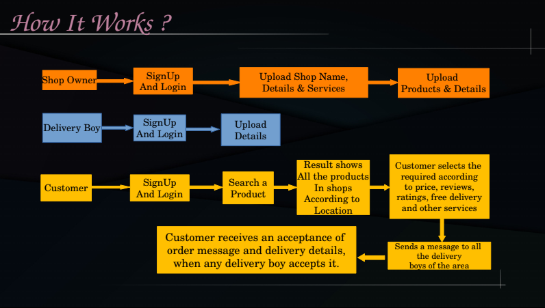

## Problem Statement :

In the era of Flipkart, Amazon people like online instead of a
offline local shop. So what happen if we can make a platform where
they can sell their product through online?
What happens if an unemployed person gets a part time job ?
Can we not develop cottage industries using modern Technology ?
Many students have innovative ideas. But they can not apply it in
real life due to money. What happens if they can do par-time job for
money and then make a product, and sell it ?
Start-ups, Companies, shop owner should know choice of public. So
can we not give them public choice ?
For a person who is new in a place should know which shop is good,
which not ?
Someone who don't have a shop can also sell their products
through a online platform. But in offline market it is not possible.
But in case of online then they also sell.

## Our Project :

In this project we are making an App where shop owner registers
their shop and products. Customer search products, and when
found it, they will know from which shop they can buy it, and
what is the price of it. They will be able to see reviews and rating
from previous buyers and can decide about buying it and can also
see the rating of the shop.
Jobless persons or even students can work as delivery agent as a
part-time job.
Cottage industries can shell their products online.
Persons(or students) making awesome gadgets with innovative
ideas can shell their products.
Start-ups and companies be able to know public choices and can
make products according to those choices.
Shop owner can sell their products in his shop according to public
choice.
We will advertise famous shops of a area in our front-page free of
cost and Unfamous shops in our FrontPage by giving subscription.

## Features :

1. Price Predictor using ML
2. View Similar Products
3. Predict Quality of Shop and Products by Previous reviews
   of User

## Business Plan or How We get Profit ??

1. Customers can searches products using features. So from
   there we can get a dataset of Which features of a product
   customer wants more and which not. We can sell this datasets to
   many companies and start-ups.
   By this datasets they will know which feature public likes most
   and which not. By this they can make such products and optimize
   price.
2. We will advertise many shops which are not so famous in
   market on FrontPage and for this they should take subscription.

## CODE  \[ Not Visible Publicaly ]

As the website is very large, can't deployed in Heroku or other free cloud hosting.

## Winner Certificate :

