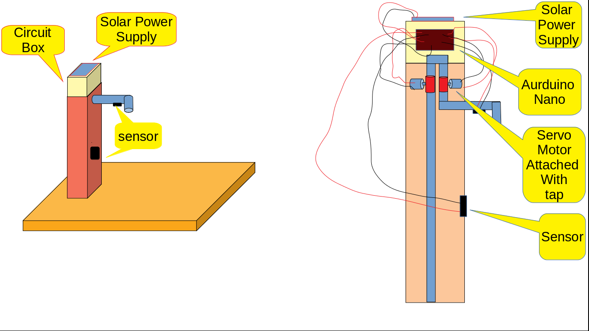
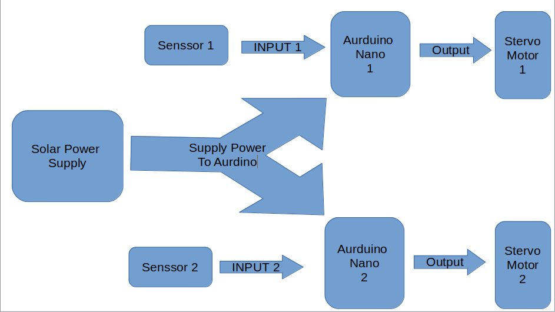
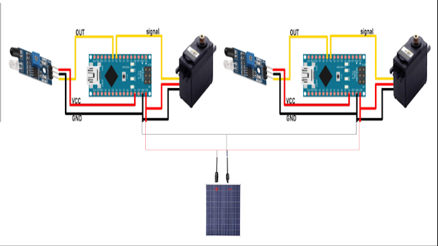

## ***Introduction :***

Nowadays a great problem of our world is shortage of water. Some day before I read a news that in somewhere of india people should buy water by selling things of their house.In future this problem arise all over the world. But knowing this we waste water. So to solve this problem how much I can, I made a idea i.e. automatic public water tap.

## Problem Statement:

In The road side water tap we see that a huge amount of water is wasting when people does not turn off the tap after taking water. In this project I give an Idea of automatic water tap which is turn on when a person take an bottle or bucket in font of the tap.Wasting of water in public water tap will stop which solve water shortage problem.

## Image of Prototype :

## Specification :

| \--------------------------------- | \--------------------------------------- |
| ---------------------------------- | ---------------------------------------- |
| Material                           | Any                                      |
| Installation Type                  | Installed on the road side               |
| Sensor Type                        | Infrared Sensor                          |
| Power Supply                       | Solar Power Supply                       |
| Motor Type                         | Servo Motor                              |
| Sensor Type                        | Infrared Sensor                          |
| Aurdino Type                       | Aurdino Nano                             |

\-------------------------------------------------------------------------------------------

## Functional Timing :

When a bottle or bucket is putting under the the tap , both sensor detect that something is under it. Then both servo motor rotate and water will flow.

## Block Diagram :

## Circuit Diagram :

## Algorithm :

1. Solar power supply initialize the IR Sensor, Servo Motor
2. Sensor 1 watch a object and servo motor 1 rotates, and Sensor 2 watch a object and motor 2 rotates.
3. When both motors rotates then water run.

#### Note : I Use Two sensor, beacause if any unwanted obstacle comes near the sensor it rotates the motor and water will waste.

I was made this project in ***beginning* of 1st year** when I had not such coding knowledge. this project will be made using ***one Arduino and one IR Sensor.***
